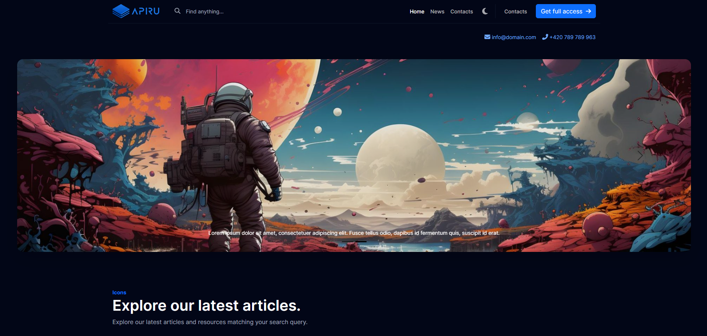

## WordPress Development Environment ("WPDE")

WordPress Development Environment ("WPDE") is a fantastic starting point for creating a WordPress template.  
Includes necessary files and features for proper template functioning.



## Demo

Check out the [WPDE](https://wpde.jindrichrucil.com/) template

## Overview
-   Responsive
-   Light/Dark mode
-   Accessibility

## Features

-   Breadcrumbs 
```php 
WPDE()->breadcrumbs(); 
```
-   Bootstrap 5 Pagination
```php 
WPDE()->pagination(); 
```
-   Light/Dark mode with toggler
```php 
WPDE()->theme(); 
```

## Libraries

-   [Bootstrap 5](https://getbootstrap.com/)
-   [Bootstrap 5 Navbar Walker](https://github.com/AlexWebLab/bootstrap-5-wordpress-navbar-walker)
-   [Bootstrap Icons](https://icons.getbootstrap.com/)
-   [CookieConsent](https://github.com/orestbida/cookieconsent)
-   [Magnific popup](https://dimsemenov.com/plugins/magnific-popup/)

## Development Tools

-   [SASS](https://sass-lang.com/)
-   [Webpack](https://webpack.js.org/)
-   [Prettier](https://prettier.io/)

## Commands

```sh
# Bundles the application
npm run start

# Formats the codebase
npm run format

# Deletes the build JavaScript and CSS files
npm run clear
```

## Requirements

-   **WordPress:** 6.0 or higher
-   **PHP:** 7.0 or higher

## Installation

### Install from WordPress

1. **Download** "WPDE"
2. **Visit** Appearance > Themes > Add New Theme > Upload Theme > wpde.zip > Install Now > Activate
3. **Click** on the new menu item "Theme Settings" for better control of theme

### Manual Install

1. **Download** "WPDE"
2. **Extract & Upload** "wpde" folder to /wp-content/themes/
3. **Visit** Appearance > Themes > Search for WPDE > Activate
4. **Click** on the new menu item "Theme Settings" for better control of theme

## License

Distributed under the **MIT** License. See [LICENSE](https://github.com/rucilos/wpde/blob/master/LICENSE) for more information.

## Credits

© 2024 Created by [Jindřich Ručil](https://jindrichrucil.com)

## Changelog

See [CHANGELOG](https://github.com/rucilos/wpde/blob/master/changelog.md) for more information.
